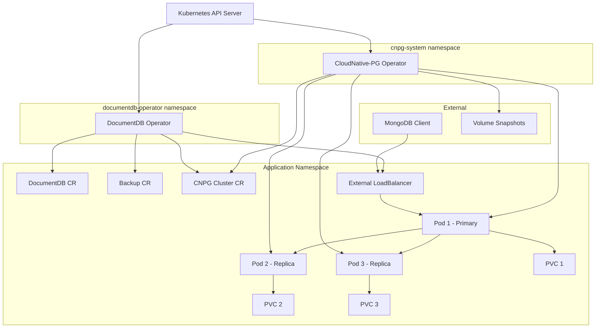
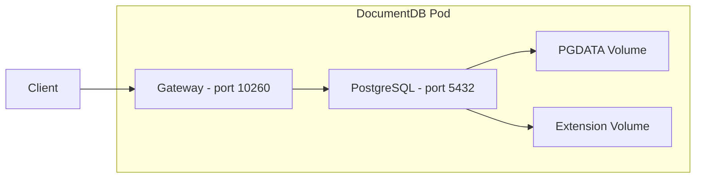
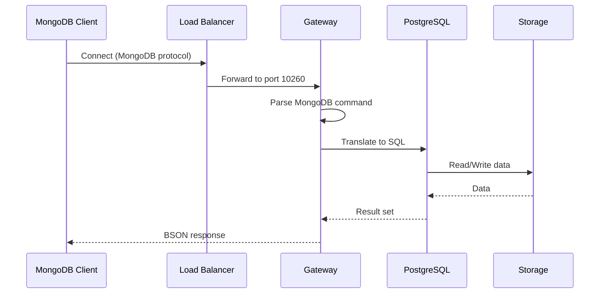
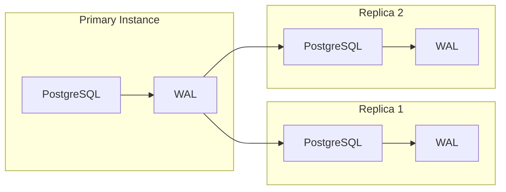
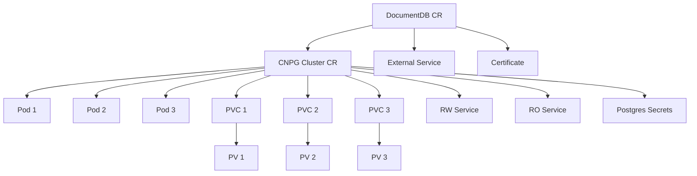
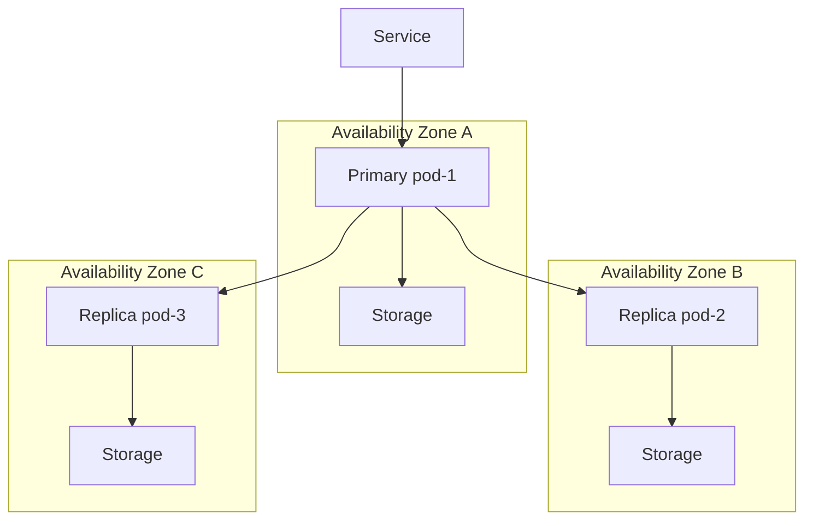
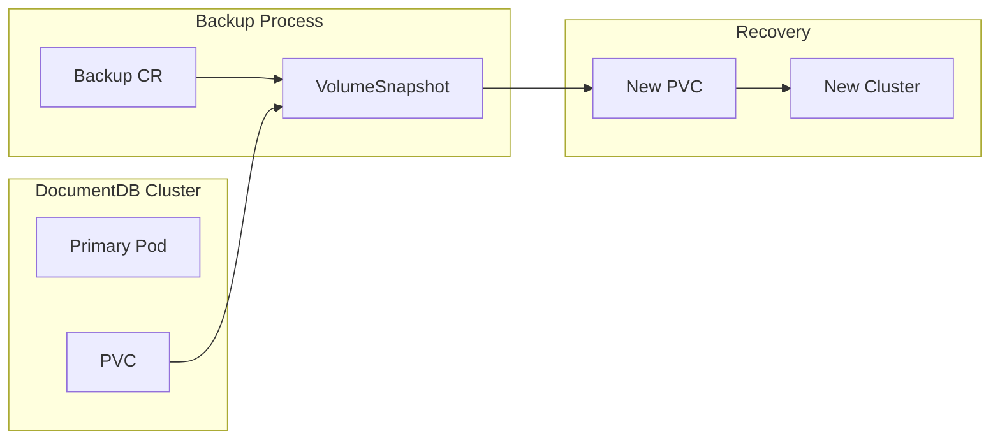

# Architecture Overview

This page describes the architecture of the DocumentDB Kubernetes Operator, its components, and how they work together to manage DocumentDB clusters on Kubernetes.

## System architecture

The DocumentDB Kubernetes Operator extends Kubernetes with custom resources to declaratively manage DocumentDB clusters. It builds on [CloudNative-PG](https://cloudnative-pg.io/) for PostgreSQL management while adding the DocumentDB Gateway for MongoDB-compatible access.

## Core components

### DocumentDB Operator

The DocumentDB Operator is a Kubernetes controller that manages the lifecycle of DocumentDB clusters. It is deployed as a single pod in the `documentdb-operator` namespace.

**Responsibilities:**

- Watches `DocumentDB`, `Backup`, and `ScheduledBackup` custom resources
- Creates and configures CNPG `Cluster` resources
- Manages TLS certificates via cert-manager
- Handles backup creation and retention
- Manages PersistentVolume lifecycle for data recovery

**Controllers:**

| Controller | Purpose |
|------------|---------|
| DocumentDB Controller | Reconciles `DocumentDB` CRs, creates CNPG clusters |
| Backup Controller | Handles on-demand backup requests |
| ScheduledBackup Controller | Manages scheduled backup jobs |
| Certificate Controller | Provisions TLS certificates for gateway |
| PV Controller | Manages PV labels and reclaim policies |

### CloudNative-PG Operator

[CloudNative-PG](https://cloudnative-pg.io/) is an open-source PostgreSQL operator that handles the low-level PostgreSQL cluster management. It is installed as a Helm dependency and runs in the `cnpg-system` namespace.

**Responsibilities:**

- Pod lifecycle management (create, delete, restart)
- Streaming replication setup between primary and replicas
- Automatic failover when primary becomes unhealthy
- Connection pooling and service management
- Rolling updates and maintenance operations

### DocumentDB pod architecture

Each DocumentDB instance runs as a Kubernetes pod with two containers:

| Container | Image | Purpose |
|-----------|-------|---------|
| **PostgreSQL** | `ghcr.io/cloudnative-pg/postgresql:18-minimal-trixie` | Database engine with DocumentDB extension |
| **Gateway** | `ghcr.io/documentdb/documentdb-kubernetes-operator/gateway` | MongoDB wire protocol translation |

| Volume | Purpose |
|--------|---------|
| **PGDATA** | PostgreSQL data directory (PVC-backed) |
| **Extension** | DocumentDB extension files (ImageVolume) |

### Services

Kubernetes Services expose DocumentDB to clients:

| Service | Created By | Purpose |
|---------|------------|----------|
| `documentdb-service-<name>` | DocumentDB Operator | External LoadBalancer for client access |
| `<cluster>-rw` | CNPG | Internal read-write access (primary only) |
| `<cluster>-r` | CNPG | Internal access to any instance |

For external access, configure `spec.exposeViaService.serviceType: LoadBalancer`. The DocumentDB operator creates the external LoadBalancer service (`documentdb-service-<name>`) that routes traffic to the primary pod.

## Data flow

### Client connection flow

### Replication flow

DocumentDB uses PostgreSQL's native streaming replication:

1. **Primary** writes to the Write-Ahead Log (WAL)
2. **WAL Sender** streams changes to replicas
3. **WAL Receiver** on replicas applies changes
4. Replication is **asynchronous** by default (milliseconds of lag)

## Kubernetes resources

When you create a `DocumentDB` resource, the operator creates and manages these Kubernetes resources:

| Resource | Controller | Purpose |
|----------|------------|---------|
| `DocumentDB` | User | Desired state definition |
| `Cluster` (CNPG) | DocumentDB Operator | PostgreSQL cluster configuration |
| `Pod` | CNPG Operator | Database instances |
| `PVC` | CNPG Operator | Persistent storage claims |
| `PV` | Storage provisioner | Actual storage volumes |
| `Service` | CNPG Operator | Internal cluster access |
| `Service` (external) | DocumentDB Operator | External LoadBalancer access |
| `Certificate` | DocumentDB Operator | TLS certificate request |
| `Secret` | cert-manager / CNPG | Credentials and certificates |

## High availability architecture

With `instancesPerNode: 3`, the operator deploys a highly available configuration:

**Failover behavior:**

1. Primary becomes unhealthy (readiness probe fails)
2. CNPG operator selects most up-to-date replica
3. Selected replica promotes to primary (~30 seconds)
4. Service endpoints update automatically
5. Former primary restarts as replica

For detailed HA configuration, see [Advanced Configuration](../advanced-configuration/README.md#high-availability).

## Backup architecture

DocumentDB supports volume snapshot-based backups:

For backup configuration, see [Backup and Restore](../backup-and-restore.md).

## Dependencies

| Dependency | Version | Purpose |
|------------|---------|---------|
| [CloudNative-PG](https://cloudnative-pg.io/) | 1.28+ | PostgreSQL cluster management |
| [cert-manager](https://cert-manager.io/) | 1.19+ | TLS certificate management |
| Kubernetes | 1.35+ | Container orchestration (ImageVolume feature required) |

## Next steps

- [Before You Start](../getting-started/before-you-start.md) - Prerequisites and terminology
- [Quickstart](../index.md) - Deploy your first DocumentDB cluster
- [API Reference](../api-reference.md) - Full CRD documentation
