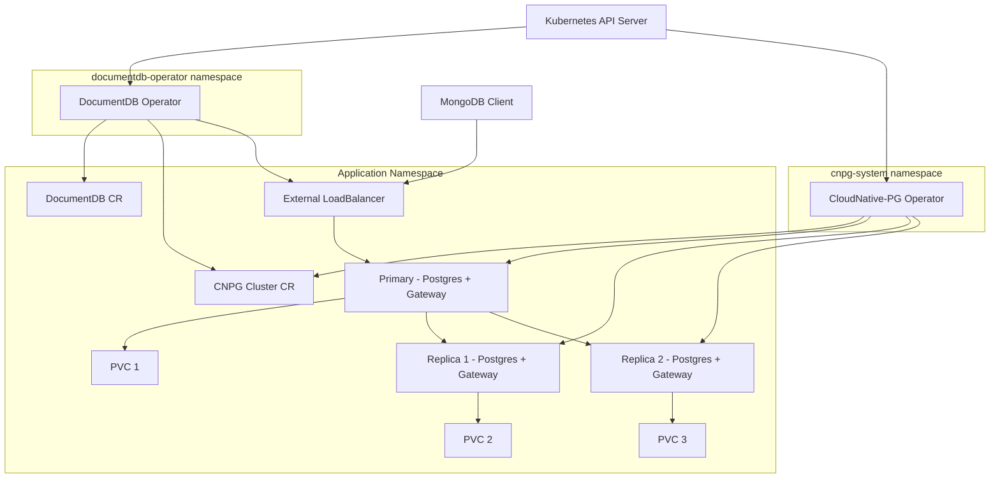

# Before You Start

This page covers the prerequisites, terminology, and concepts you should understand before deploying DocumentDB on Kubernetes.

## Prerequisites checklist

Before installing the DocumentDB Kubernetes Operator, ensure you have the following:

### Required components

| Component | Minimum Version | Purpose | Installation Guide |
|-----------|-----------------|---------|-------------------|
| **Kubernetes cluster** | 1.35+ | Container orchestration platform | See [Cluster Options](#kubernetes-cluster-options) |
| **kubectl** | 1.35+ | Kubernetes command-line tool | [Install kubectl](https://kubernetes.io/docs/tasks/tools/) |
| **Helm** | 3.x | Package manager for Kubernetes | [Install Helm](https://helm.sh/docs/intro/install/) |
| **cert-manager** | 1.19+ | TLS certificate management | [Install cert-manager](https://cert-manager.io/docs/installation/) |

!!! warning "Kubernetes 1.35+ Required"
    The operator requires Kubernetes 1.35 or later because it uses the [ImageVolume](https://kubernetes.io/docs/concepts/storage/volumes/#image) feature (GA in Kubernetes 1.35) to mount the DocumentDB extension into PostgreSQL pods.

### Optional components

| Component | Purpose | When Needed |
|-----------|---------|-------------|
| **mongosh** | MongoDB shell for connecting to DocumentDB | Testing and administration |
| **Azure CLI** | Azure resource management | Deploying on AKS |
| **AWS CLI + eksctl** | AWS resource management | Deploying on EKS |
| **gcloud CLI** | Google Cloud resource management | Deploying on GKE |

### Kubernetes cluster options

The operator runs on any conformant Kubernetes distribution (1.35+). Choose based on your environment:

=== "Local Development"

    For local development and testing:
    
    - **[kind](https://kind.sigs.k8s.io/)** (v0.31+) - Kubernetes in Docker, recommended for development
    - **[minikube](https://minikube.sigs.k8s.io/)** - Local Kubernetes cluster
    
    ```bash
    # Kind (recommended)
    kind create cluster --image kindest/node:v1.35.0
    
    # Minikube
    minikube start --kubernetes-version=v1.35.0
    ```

=== "Cloud Production"

    For production deployments:
    
    - **[Azure Kubernetes Service (AKS)](https://github.com/documentdb/documentdb-kubernetes-operator/blob/main/documentdb-playground/aks-setup/README.md)** - Microsoft Azure
    - **[Amazon EKS](deploy-on-eks.md)** - Amazon Web Services
    - **Google Kubernetes Engine (GKE)** - Google Cloud Platform

### Resource requirements

Minimum resources for a basic DocumentDB deployment:

| Resource | Minimum | Recommended (Production) |
|----------|---------|--------------------------|
| **CPU** | 2 cores | 4+ cores |
| **Memory** | 4 GB | 8+ GB |
| **Storage** | 10 GB | 50+ GB (SSD recommended) |
| **Nodes** | 1 | 3+ (for high availability) |

## Terminology

### Kubernetes concepts

Understanding these Kubernetes concepts helps you work effectively with the DocumentDB operator:

| Term | Definition |
|------|------------|
| **[Pod](https://kubernetes.io/docs/concepts/workloads/pods/)** | The smallest deployable unit in Kubernetes. DocumentDB runs as pods containing the database and gateway containers. |
| **[Service](https://kubernetes.io/docs/concepts/services-networking/service/)** | An abstraction that exposes pods to network traffic. DocumentDB uses Services to enable client connections. |
| **[PersistentVolumeClaim (PVC)](https://kubernetes.io/docs/concepts/storage/persistent-volumes/)** | A request for storage. DocumentDB stores data on PVCs backed by your cluster's storage class. |
| **[StorageClass](https://kubernetes.io/docs/concepts/storage/storage-classes/)** | Defines storage characteristics (performance tier, provisioner). Choose based on your cloud provider. |
| **[Namespace](https://kubernetes.io/docs/concepts/overview/working-with-objects/namespaces/)** | A logical partition within a cluster. Deploy DocumentDB in its own namespace for isolation. |
| **[Custom Resource (CR)](https://kubernetes.io/docs/concepts/extend-kubernetes/api-extension/custom-resources/)** | An extension of the Kubernetes API. `DocumentDB`, `Backup`, and `ScheduledBackup` are custom resources. |
| **[Custom Resource Definition (CRD)](https://kubernetes.io/docs/tasks/extend-kubernetes/custom-resources/custom-resource-definitions/)** | Defines the schema for a custom resource. The operator installs CRDs for its resources. |
| **[Operator](https://kubernetes.io/docs/concepts/extend-kubernetes/operator/)** | A controller that manages custom resources. The DocumentDB operator manages the lifecycle of DocumentDB clusters. |
| **[ConfigMap](https://kubernetes.io/docs/concepts/configuration/configmap/)** | Stores non-sensitive configuration data. The operator uses ConfigMaps for certain settings. |
| **[Secret](https://kubernetes.io/docs/concepts/configuration/secret/)** | Stores sensitive data like passwords. DocumentDB credentials are stored in Secrets. |

### DocumentDB concepts

| Term | Definition |
|------|------------|
| **DocumentDB Cluster** | A managed deployment of DocumentDB on Kubernetes, represented by the `DocumentDB` custom resource. |
| **Instance** | A single PostgreSQL + Gateway pod. A cluster can have 1-3 instances for high availability. |
| **Primary** | The instance that accepts write operations. There is always exactly one primary per cluster. |
| **Replica** | A read-only instance that replicates data from the primary. Replicas can be promoted during failover. |
| **Gateway** | A sidecar container that provides MongoDB-compatible API on top of PostgreSQL. Clients connect to the gateway. |
| **Node** | In DocumentDB terms, a logical grouping of instances. Currently limited to 1 node per cluster. |

### Cloud and infrastructure concepts

| Term | Definition |
|------|------------|
| **Region** | A geographic location where cloud resources are deployed (for example, `us-west-2`, `westus2`). |
| **Availability Zone (AZ)** | An isolated location within a region. Distribute instances across zones for resilience. |
| **Load Balancer** | Distributes traffic across instances. Use `LoadBalancer` service type for external access. |
| **Storage Class** | Cloud-specific storage configuration. Examples: `managed-csi` (AKS), `gp3` (EKS). |

### High availability concepts

| Term | Definition |
|------|------------|
| **High Availability (HA)** | Running multiple instances to survive failures. Set `instancesPerNode: 3` for HA. |
| **Failover** | Automatic promotion of a replica to primary when the primary fails. |
| **RTO (Recovery Time Objective)** | Maximum acceptable downtime after a failure. Local HA typically achieves < 30 seconds. |
| **RPO (Recovery Point Objective)** | Maximum acceptable data loss. With streaming replication, RPO is near-zero (milliseconds of lag). |
| **Replication Lag** | The delay between writes on the primary and their application on replicas. |

## Architecture overview

For a detailed explanation of how the operator works, see [Architecture Overview](../architecture/overview.md).



## Next steps

- [Quickstart](../index.md) - Deploy your first DocumentDB cluster
- [Deploy on AKS](https://github.com/documentdb/documentdb-kubernetes-operator/blob/main/documentdb-playground/aks-setup/README.md) - Production deployment on Azure
- [Deploy on EKS](deploy-on-eks.md) - Production deployment on AWS
